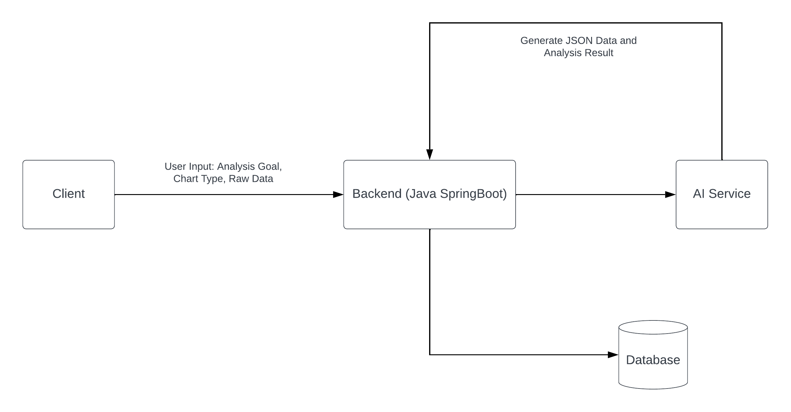
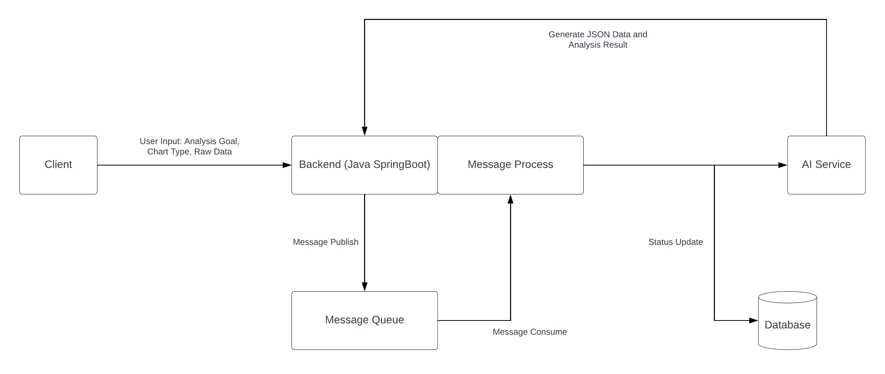

# AIGC BI System

In the realm of traditional Business Intelligence (BI), data analysts typically face the arduous task of manually analyzing imported data. However, our cutting-edge AIGC BI System revolutionizes this process by harnessing the power of artificial intelligence (AI).

With our system, data analysts can bid farewell to the labor-intensive task of chart creation. Instead, our AI capabilities take the reins, automatically generating charts that precisely meet the user's requirements or adhere to a specified chart style. Moreover, our system offers robust chart management features, enabling seamless organization and access to a plethora of visual insights.

One standout feature of our AIGC BI System is the ability to asynchronously generate charts. This means that data analysts can initiate chart generation tasks and continue with their analysis, freeing them from waiting for each chart to be generated in real-time.

In addition to this, our system excels at delivering insightful analysis conclusions, sparing data analysts the need to manually interpret data patterns. All these elements combined make our AIGC BI System a game-changer in the world of data analysis and visualization.


## Requirement Analysis

1.  `AI Analysis`: User enter their goal and chart type. It will automatically generate the chart data in JSON format and analysis conclusion
2. `Chart Management`
3. `Asynchronization of chart generation (message queue)`
4. `OpenAI API`


## Basic Process

The client enters analysis goal and raw data, and sends a request to the backend. The backend uses AI services to process client data, save it to the database, and generate charts. The processed data is sent to the AI service by the backend, and the AI service generates a result and returns it to the backend, and finally returns the result to the client for display.



**Problem:**

In the context of AI services, the computational demands inherent in data generation and analysis often give rise to latency issues. Particularly, when users contend with substantial datasets, the waiting period for results can extend to several minutes or more. Furthermore, the concurrent influx of service requests from numerous users can impose significant strain on the AI infrastructure, potentially leading to resource scarcity.

To address these challenges, we have implemented a solution in the form of message queues. Within this framework, users are required to submit job requests, which are systematically queued for processing. Our AI service, in turn, methodically handles these queued requests on a first-in, first-out basis.

This strategic deployment of message queues serves as a formidable optimization tool. It adeptly alleviates the system pressure that typically accompanies the simultaneous processing of numerous requests. Furthermore, it enables meticulous resource management, ensuring that our computational assets are employed judiciously and efficiently.

In essence, the utilization of message queues elevates the operational efficiency and user experience of our AI service. It effectively mitigates latency concerns, rendering our service scalable and resilient in the face of substantial user demand.



`Optimization process (asynchronous)`: The client inputs analysis goal and raw data, and sends requests to the backend. The backend puts the request event into the message queue, and generates a pick-up number for the client, so that the client who wants to generate the chart goes to the queue. The message queue checks the progress regularly according to the load of the AI service. If the AI service can handle more, then send a message to the Message Process module.

The Message Process module calls the AI service to process client data. The AI service asynchronously generates results and returns them to the backend and saves them in the database. The status of the chart generation service in the database to determine whether the generation results are available. If the generated result is available, the front end can obtain and process the corresponding data, and finally return the result to the client for display. During this period, users can go about their own business.


## Tech Stack

- Frontend:
  - React
  - Umi
  - Ant Design Pro
  - Echarts
  - Umi OpenAPI
- Backend:
  - Spring Boot 3: Based on my User Center Project
  - MySQL
  - Redis, Redission: rate limit
  - MyBatis, MyBatis Plus: Access database
  - MQ: RabbitMQ
  - AI Service: Open AI
  - EasyExcel: Excel upload
  - Swagger Docs
  - Hutool: small but comprehensive library of Java tools


## DataBase

```sql
-- chart table
create table if not exists chart
(
    id           bigint                           auto_increment comment 'id' primary key,
    goal		 text                                       null comment 'goal',
    `name`       varchar(128)                               null comment 'chart name',
    chartData    text                                       null comment 'chart raw data',
    chartType	 varchar(128)                               null comment 'chart type',
    genChart	 text	                                    null comment 'generated chart',
    genResult	 text	                                    null comment 'generated result',
    status       varchar(128)                           not null default 'wait' comment 'wait,running,succeed,failed',
    execMessage  text                                       null comment 'executive message',
    userId       bigint                                     null comment 'user id',
    createTime   datetime     default CURRENT_TIMESTAMP not null comment 'create time',
    updateTime   datetime     default CURRENT_TIMESTAMP not null on update CURRENT_TIMESTAMP comment 'update time',
    isDelete     tinyint      default 0                 not null comment 'is delete'
) comment 'chart' collate = utf8mb4_unicode_ci;
```


## Data Compression

OpenAI GPT model has a token limit. For example, 4097 tokens are max tokens for`gpt-3.5-turbo`. So we can compress the data and let the user enter as much data as possible.

We will transform data from an Excel data into a CSV data. It achieves a 30% increase in single input data capacity.

##### Take Temperature.xlsx as an example:

```
// xlsx data format
"usage": {
    "prompt_tokens": 2053,
    "completion_tokens": 1610,
    "total_tokens": 3663
}
```

```
// csv data format
"usage": {
    "prompt_tokens": 1417,
    "completion_tokens": 1816,
    "total_tokens": 3233
}
```

***(2053 - 1417) / 2053 = 30.98%***


##### Take temp.xlsx as an example:

```
// xlsx data format
"usage": {
    "prompt_tokens": 2157,
    "completion_tokens": 831,
    "total_tokens": 2988
}
```

```
// csv data format
"usage": {
    "prompt_tokens": 1437,
    "completion_tokens": 1045,
    "total_tokens": 2482
}
```

***(2157 - 1437) / 2157 = 33.36%***


## AI Prompt

**For System role:**

```
You are a data analyst and front-end development expert, then I will provide you with content in the following fixed format: Analysis requirements: {requirement or goal of data analysis} Raw data: {raw data in csv format, with ',' as delimiter}
```

**For Assistant role:**

```
Please generate content according to the following specified format based on these two parts. In addition, do not output any redundant beginning, end, and comments. Separate two parts by five '='. {This is the first part. The configuration object of the front-end Echarts V5, reasonably visualize the data, and do not generate any redundant content, such as comments. Only json data object. Do not assign the data object to a variable called 'option'. It should start with '{' and end with '}' } ===== {Clear data analysis conclusion, the more detailed the better, do not generate redundant notes}
```

**For User role:**

```
Analysis requirement:{your analysis goal}.Please use {chart type}.Raw data:{csv data}
```

### Examples

```
{
    "model": "gpt-3.5-turbo",
    "messages": [
        {
            "role": "system",
            "content": "You are a data analyst and front-end development expert, then I will provide you with content in the following fixed format: Analysis requirements: {requirement or goal of data analysis} Raw data: {raw data in csv format, with , as delimiter}"
        },
        {
            "role": "user",
            "content": "Analysis requirements: future forecast, Please use bar chart. Raw data: {date, user_number \n 08/01/2023, 10 \n 08/02/2023, 20 \n 08/03/2023, 30}"
        },
        {
            "role": "assistant",
            "content": "Please generate content according to the following specified format based on these two parts (in addition, do not output any redundant beginning, end, and comments).  do not place them into a code block. Separate two parts by five '='.===== {The configuration object of the front-end Echarts V5, reasonably visualize the data, and do not generate any redundant content, such as comments. Only json data object. Do not assign the data object to a variable } ===== {Clear data analysis conclusion, the more detailed the better, do not generate redundant notes}"
        }
    ]
}
```

```
{
    "id": "chatcmpl-7teGOUF1Yg5bjp1aUH6iRicIV3njI",
    "object": "chat.completion",
    "created": 1693497168,
    "model": "gpt-3.5-turbo-0613",
    "choices": [
        {
            "index": 0,
            "message": {
                "role": "assistant",
                "content": "=====\n{ \"xAxis\": { \"type\": \"category\", \"data\": [\"08/01/2023\", \"08/02/2023\", \"08/03/2023\"] }, \"yAxis\": { \"type\": \"value\" }, \"series\": [{ \"data\": [10, 20, 30], \"type\": \"bar\" }] }\n=====\nBased on the provided raw data, a bar chart has been generated to visualize the future forecast of user numbers. The chart shows the user numbers per date for the dates \"08/01/2023\", \"08/02/2023\", and \"08/03/2023\". \n\nFrom the chart, it can be observed that the user numbers are increasing over time. On \"08/01/2023\", there were 10 users, which increased to 20 on \"08/02/2023\", and further increased to 30 on \"08/03/2023\". This indicates a positive growth trend in the user numbers."
            },
            "finish_reason": "stop"
        }
    ],
    "usage": {
        "prompt_tokens": 231,
        "completion_tokens": 209,
        "total_tokens": 440
    }
}
```

